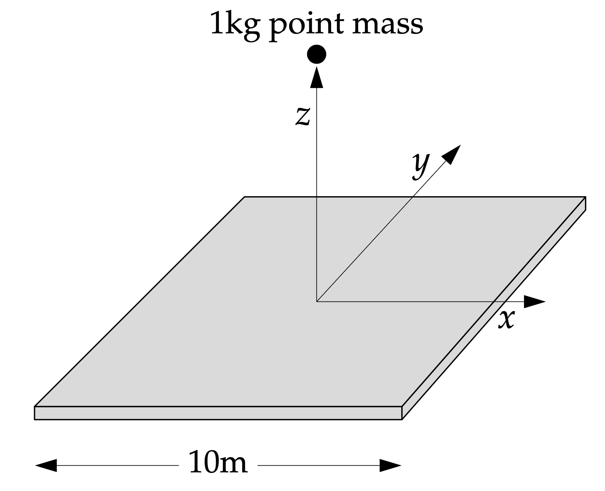

# 项目5：方形金属板的引力计算与分析

## 1. 项目背景

我们考虑一个质量均匀分布的正方形金属板，它漂浮在空中并保持静止。

*   金属板边长 $L = 10 ~ \text{m}$
*   金属板厚度可以忽略
*   金属板总质量 $M_{plate} = 10 ~ \text{吨} = 10^4 ~ \text{kg}$

我们需要计算的是，在该正方形金属板中心垂直正上方距离 $z$ 处，一个质量为 $m_{particle} = 1 ~ \text{kg}$ 的质点所受到的万有引力。具体来说，我们关注引力沿 $z$ 轴方向的分量 $F_z$。该力可以表示为：

$$
F_z(z) = G \sigma m_{particle} z \iint_{-L/2}^{L/2} \frac{dx ~ dy}{(x^2+y^2+z^2)^{3/2}}
$$

其中：
*   $G = 6.674 \times 10^{-11} ~ \text{m}^3 ~ \text{kg}^{-1} ~ \text{s}^{-2}$ 是万有引力常数。
*   $\sigma = M_{plate} / L^2$ 是金属板单位面积的质量（面密度）。
*   $m_{particle} = 1 ~ \text{kg}$ 是测试质点的质量。 (您的代码中，此值默认为1kg，力以牛顿为单位)。

## 2. 项目任务

### 2.1 计算并绘制引力曲线
1.  **参数计算：**
    *   计算金属板的面密度 $\sigma$。
2.  **数值积分实现：**
    *   编写 Python 程序计算上述二重积分。
    *   **要求：** 尝试自己编写一个基于**高斯-勒让德求积 (Gaussian-Legendre Quadrature)** 的二重积分函数。对于 $x$ 轴和 $y$ 轴的积分，均取 **100个样本点** (即使用100阶高斯-勒让德求积，如您代码中的 `n_points=100` 默认值)。
    *   作为对比或备选方案，你可以使用 `scipy.integrate.dblquad` (或 `scipy.integrate.nquad`) 函数进行计算，正如您的参考代码中所示。
3.  **引力计算：**
    *   计算 $F_z$ 随 $z$ 变化的值，其中 $z$ 的取值范围从接近 $0 ~ \text{m}$ (例如，您的代码中从 `z_min=0.1m` 开始绘图) 到 $10 ~ \text{m}$。选择足够多的 $z$ 点以绘制平滑曲线（例如，100个点）。
4.  **绘图：**
    *   绘制 $F_z$ 作为 $z$ 的函数的曲线图。可以同时展示自定义高斯积分方法和SciPy库函数计算得到的结果曲线。

### 2.2 结果分析与解释
1.  **观察曲线：** 你应该会观察到一条在大部分区域平滑变化的曲线。作为参考，当 $z \to 0^+$ 时 (即质点非常接近板中心，且 $z \ll L$)，理论上引力 $F_z$ 应趋近于 $2\pi G \sigma m_{particle}$。您的代码中已绘制了此理论极限线 $(2\pi G \sigma)$ 供比较，这很有帮助。然而，当 $z$ 非常小时，计算得到的引力 $F_z$ 可能会突然下降并趋于0。
2.  **现象解释：**
    *   指出这种在 $z$ 非常小时引力突然下降的现象是数值计算导致的，它并不完全反映真实的物理行为（真实物理极限是 $2\pi G \sigma m_{particle}$，而公式 $F_z = G\sigma m_{particle} z \cdot I(z)$ 在 $z=0$ 时由于外部因子 $z$ 确实为0，但我们关心的是 $z \to 0^+$ 的趋势）。
    *   详细解释为什么数值计算会在 $z$ 非常小时导致这种不准确的下降行为。思考被积函数 $1/(x^2+y^2+z^2)^{3/2}$ 在 $z \to 0^+$ 且 $x, y \to 0$ 时的行为（形成尖峰）。当 $z$ 非常小时，这个尖峰变得非常剧烈，固定数量的积分采样点（如100点）可能不足以准确捕捉此尖峰的贡献，导致对积分值 $I(z) = \iint \frac{dx ~ dy}{(x^2+y^2+z^2)^{3/2}}$ 的低估。这个被低估的积分值再乘以积分外的因子 $z$（当 $z$ 本身很小时），会导致计算出的 $F_z$ 过快地下降到零。
3.  **改进尝试：**
    *   提出并尝试至少一种方法来部分消除或至少减弱这种数值计算带来的误差，使得在 $z$ 很小时的计算结果更接近物理趋势。
    *   例如：可以考虑在 $z$ 很小时动态增加高斯积分的样本点数、使用自适应积分方法、对积分区域进行变换或分割，或者在 $z$ 极小时采用基于 $2\pi G \sigma m_{particle}$ 的解析近似等。

## 3. 技术提示
*   **$z \to 0^+$ 的行为：** 绘图时从一个小的正 $z_{min}$ 开始是避免 $z=0$ 处潜在问题的实用方法，同时仍能观察到 $z$ 趋近于0的行为。

## 4. 项目意义 (思考)

这种类型的计算可以被看作是理解星系引力的一个简化模型。例如，像银河系这样的漩涡星系，其大部分可见物质质量（恒星、气体等）都集中在一个通过银心的薄盘中。因此，银河系盘对外部天体（如卫星星系、球状星团或远处的恒星）的引力，可以用类似于我们这里探讨的公式和方法来近似计算。

